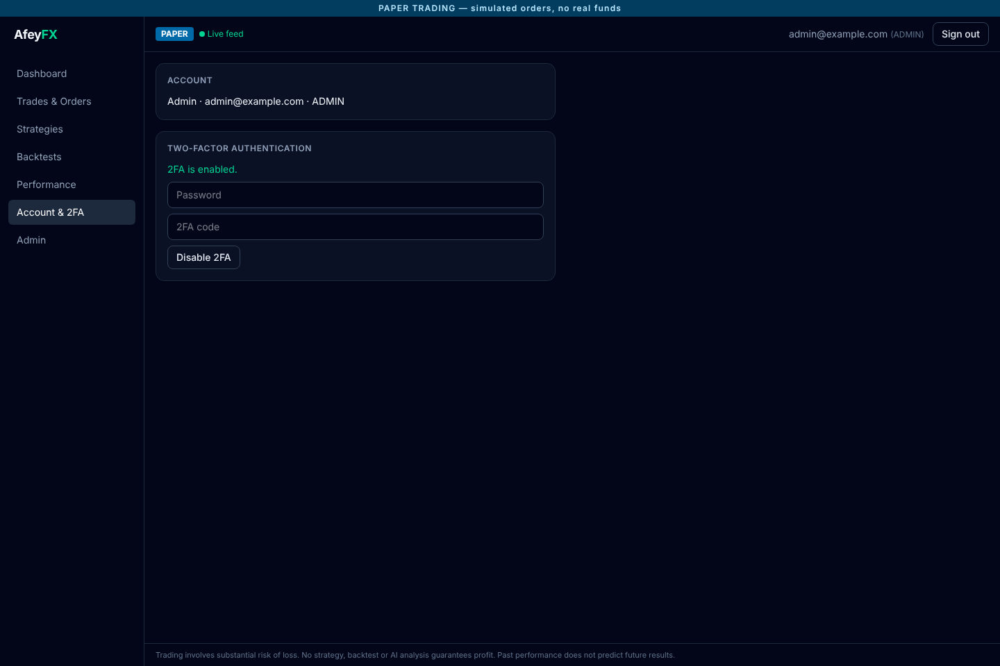
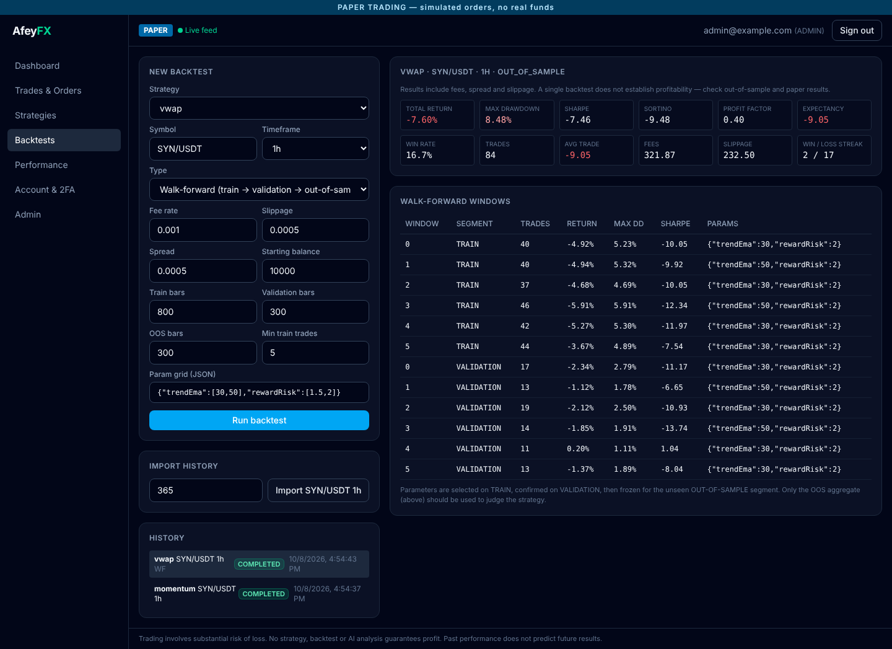
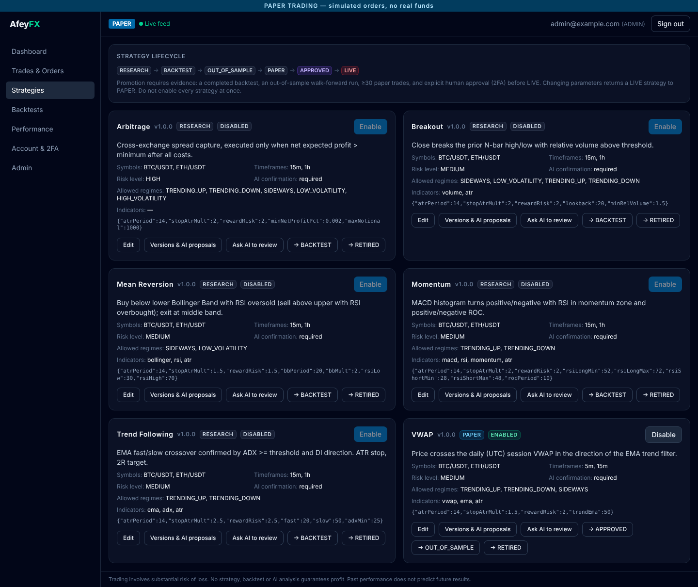
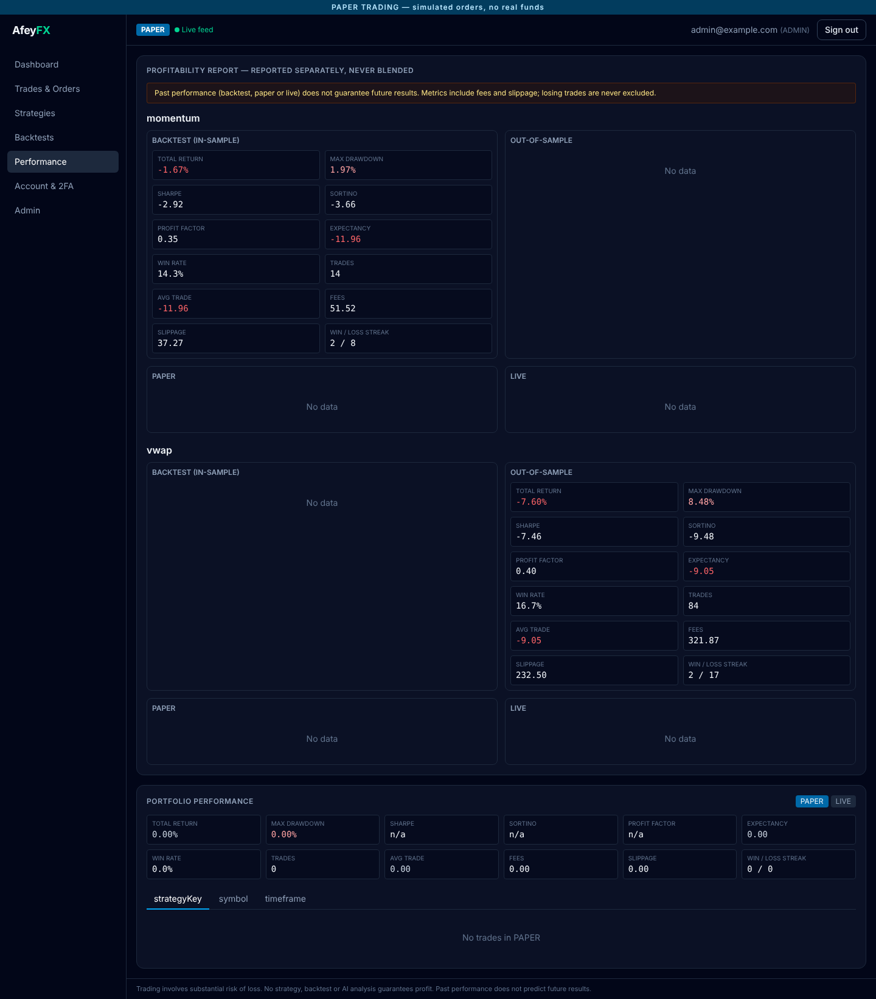
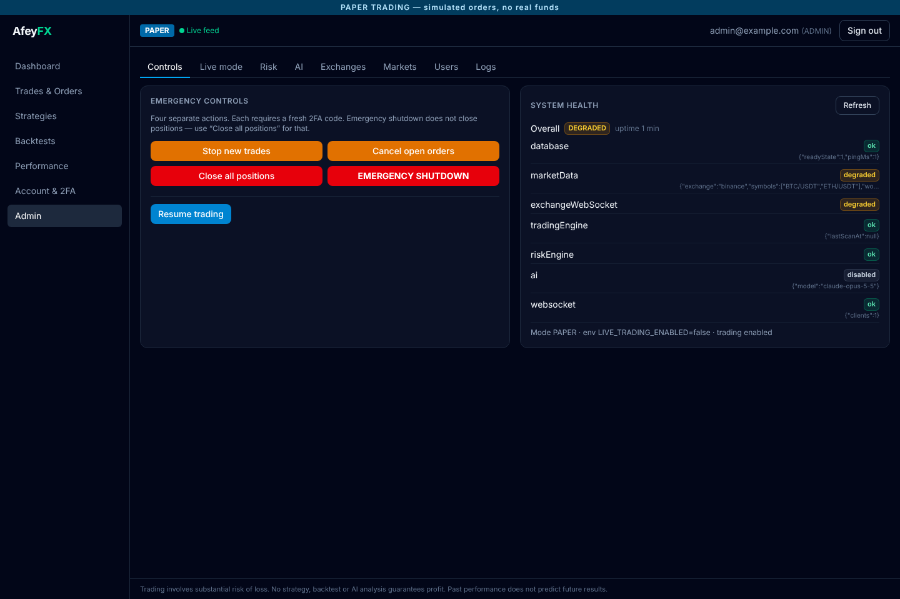
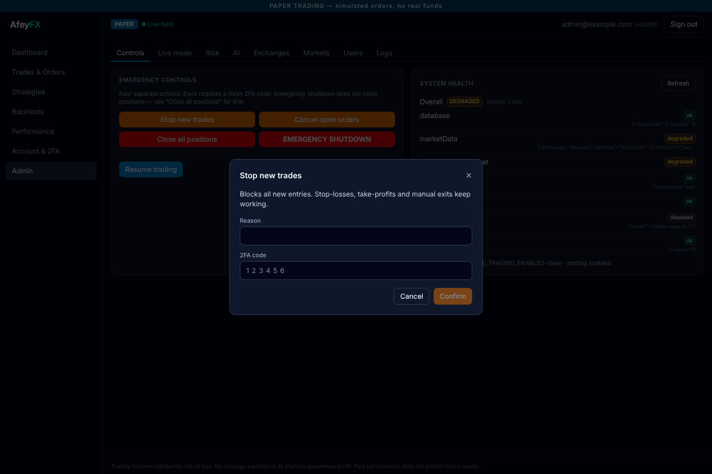
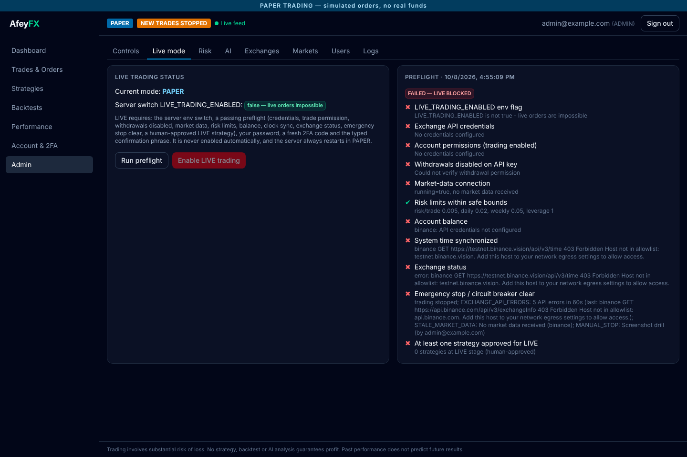
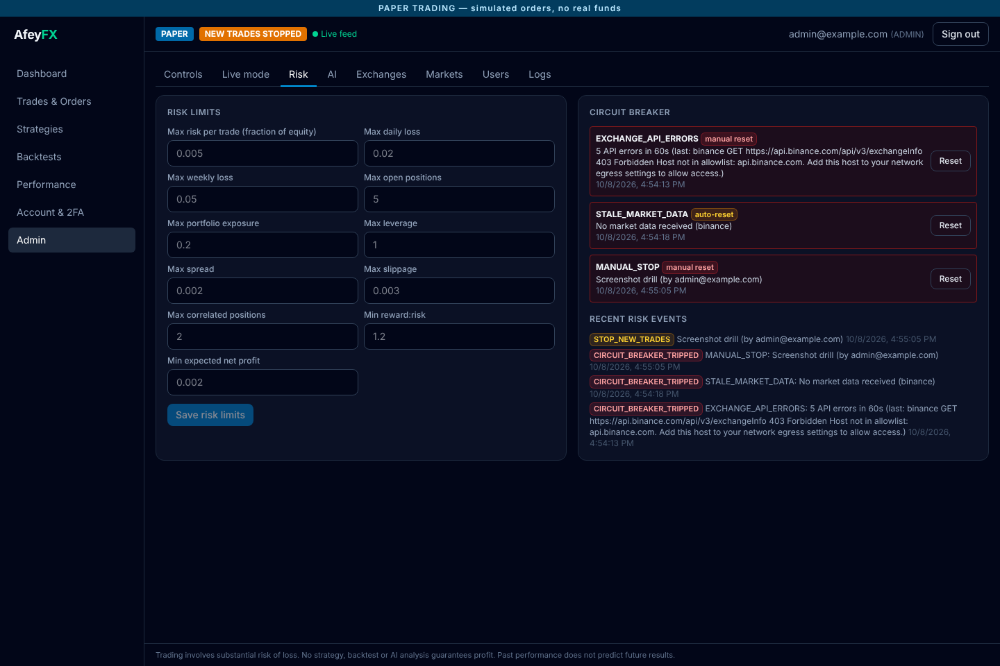

# AfeyFX — AI-assisted algorithmic trading platform

A MERN + TypeScript platform for market analysis, strategy research, backtesting, paper trading and
(guarded) live crypto trading, with Claude as an advisory analyst.

> **Risk warning.** Trading is risky and you can lose money. Nothing in this project guarantees
> profit. A strategy has to show results in backtests, then out-of-sample tests, then paper trading,
> and a human has to approve it before it can trade live. The app starts in **PAPER** mode. **LIVE**
> mode stays disabled until an authorized admin explicitly turns it on.

## Stack

| Layer | Tech |
|---|---|
| Frontend | React 19, TypeScript, Vite, Tailwind CSS 4, lightweight-charts, Socket.IO client |
| Backend | Node.js 22, Express 5, TypeScript |
| Database | MongoDB 7, Mongoose |
| Real-time | Socket.IO (dashboard), native Binance WebSocket (market data) |
| Trading | CCXT adapters (Binance, Bybit, Coinbase), exchange REST + WebSocket |
| AI | Claude API (`@anthropic-ai/sdk`), configurable model via env |
| Ops | Linux VPS, Nginx, PM2, HTTPS (Let's Encrypt) |

There is no Python in the project.

## Architecture

```
React dashboard ──REST──▶ Express API ──▶ Trading Engine
       ▲                                  │
       └────────── Socket.IO ◀── event bus ┤
                                          ▼
          Market Data ─▶ Strategy ─▶ AI analysis (veto only) ─▶ Risk Engine (final authority)
                                                                    ▼
                                         Execution (Paper broker │ LiveTradingGuard → Exchange adapter)
                                                                    ▼
                                                           Exchange REST / WS
MongoDB: users, markets, candles, strategies, signals, orders, fills, positions, trades,
portfolios, backtests, AI analyses, risk events, audit logs …
```

For more detail, see [docs/ARCHITECTURE.md](docs/ARCHITECTURE.md).

## Safety model (summary)

* **Three modes:** `BACKTEST`, `PAPER` (the default), `LIVE`. Paper and live records are stored and reported separately.
* **Real orders are refused** unless *all* of these are true:
  `LIVE_TRADING_ENABLED=true` in the server env (it cannot be set from the UI), the mode is LIVE, an admin
  activated live mode (10-check preflight, password, fresh 2FA code and a typed confirmation phrase),
  the circuit breaker is closed, and trading is not stopped. These checks run in the execution
  service **and again inside every exchange adapter**.
* **Withdrawals are never supported.** Adapters expose no withdraw or transfer methods. The CCXT client is wrapped
  so that any `withdraw*` or `transfer*` call throws. API keys that have withdrawal permission are rejected,
  and so are keys whose permissions can't be verified.
* **Claude cannot place orders.** It gets no tools and no access to the execution layer. It can only veto a strategy
  signal. The **Risk Engine has final authority**.
* **Fail closed.** The circuit breaker stops new entries when data is stale, the exchange disconnects, the spread
  or slippage is abnormal, there are repeated API errors, a loss limit is hit, the clock drifts, the database is down,
  the balance changes unexpectedly, or reconciliation finds a mismatch.
* **Every live trade is traceable** to user → strategy → signal → AI analysis → risk evaluation → orders →
  exchange responses → fills → P&L (`GET /api/trades/:id/trace`).

For more detail, see [docs/SECURITY.md](docs/SECURITY.md).

## Quick start (development)

Requirements: Node 20+ and a local MongoDB (or Docker: `docker run -d -p 127.0.0.1:27017:27017 mongo:7`).

```bash
cp .env.example .env            # then fill in the secrets: ./scripts/generate-secrets.sh
npm run install:all
npm run dev:server              # API + engine on :5000 (PAPER mode)
npm run dev:client              # dashboard on http://localhost:5173 (proxies /api and /socket.io)
```

1. Open the dashboard and create the first account. It becomes the admin. After that, public registration is closed.
2. Go to **Account & 2FA** and enable two-factor authentication. Protected actions need it.
3. Import history: Backtests → *Import history*, or `npm --prefix server run import-candles -- BTC/USDT 1h 365`.
4. Run backtests and a walk-forward test, then promote a strategy through its lifecycle to **PAPER** and enable it.

## Tests

```bash
npm test                        # server (vitest + real MongoDB) and client (vitest + jsdom)
```

The server tests need MongoDB. They use `mongodb-memory-server`, which downloads `mongod` automatically.
You can also point them at an existing instance with `MONGODB_TEST_URI=mongodb://127.0.0.1:27017`.

Notable suites:

* `liveTradingProtection.test.ts`: shows that LIVE orders can't be sent when `LIVE_TRADING_ENABLED=false`
  (the guard, the adapter, the execution service and the API all refuse, and the exchange client is never called).
* `withdrawals.test.ts`: shows that withdrawal or transfer endpoints are never called or reachable, that keys with
  withdrawal permission are flagged, and that preflight fails for them.
* The remaining suites cover indicators, regimes, strategies, risk, backtesting (look-ahead checks), walk-forward,
  the paper broker, execution (idempotency, timeout recovery), AI decision rules, the full trading-engine pipeline,
  auth/RBAC/2FA, API security, WebSockets, the database and market data.

## Project structure

```
server/src/  config controllers routes middleware models services exchanges marketData strategies
             risk execution portfolio backtesting ai notifications websocket utils jobs types
             app.ts server.ts
client/src/  components pages layouts hooks services websocket charts types utils App.tsx main.tsx
docs/        architecture, security, deployment, operations, API, strategies & risk, phase log
scripts/     setup-vps, deploy, backup, restore, healthcheck, emergency-stop, generate-secrets
deploy/      nginx site + proxy snippet, mongod.conf, logrotate
ecosystem.config.cjs   PM2
```

## Screenshots

Captured from the running app with headless Chromium (`docs/screenshots/`). The sandbox where these were taken
can't reach exchanges, so there are no live prices and the stale-data breaker is open. That's the fail-closed
behaviour working as intended. Backtests use a **synthetic** `SYN/USDT` series, and the results are shown as
they came out, losses included.

| | |
|---|---|
|  |  |
| Dashboard (PAPER) | Walk-forward backtest |
|  |  |
| Strategy lifecycle | Profitability report (separated) |
|  |  |
| Emergency controls & health | Protected action (2FA) |
|  |  |
| Live preflight (blocked) | Risk limits & circuit breaker |

## Documentation

* [Architecture](docs/ARCHITECTURE.md)
* [Security](docs/SECURITY.md)
* [Deployment (VPS, Nginx, PM2, HTTPS, MongoDB)](docs/DEPLOYMENT.md)
* [Operations: monitoring, backups, emergency shutdown, enabling live](docs/OPERATIONS.md)
* [Strategies & risk](docs/STRATEGIES_AND_RISK.md)
* [REST API](docs/API.md)
* [Development phases & verification log](docs/PHASES.md)
